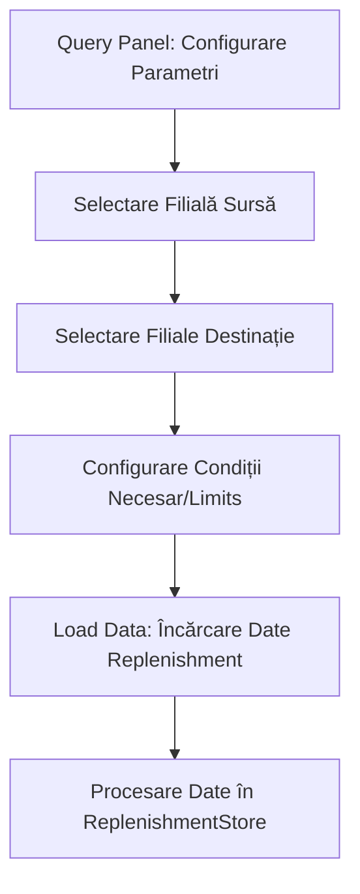
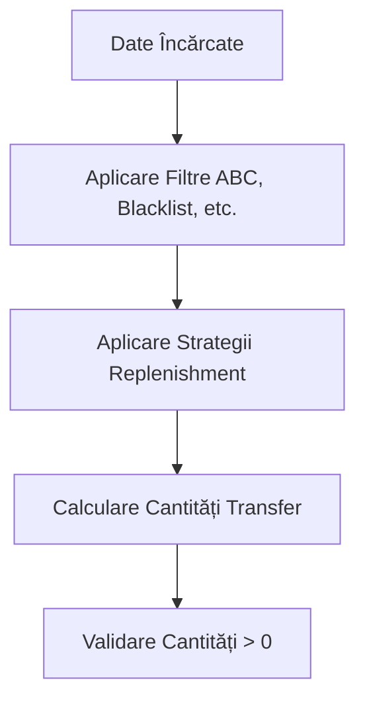
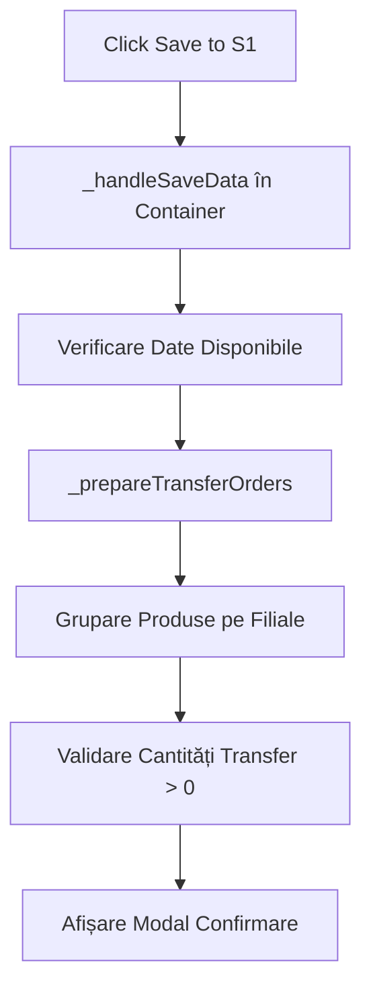

# Documentație: Mecanismul de Creare Comenzi de Transfer

## Prezentare Generală

Acest document descrie în detaliu mecanismul de creare a comenzilor de transfer în aplicația de replenishment pentru filiale. Sistemul permite transferul automat de produse între filiale prin integrarea cu SoftOne ERP.

## Arhitectura Sistemului

### Componente Principale

1. **Branch Replenishment Container** (`branch-replenishment-container.js`)
   - Containerul principal care coordonează întregul proces
   - Gestionează starea aplicației și logica de business

2. **S1 Transfer Modal** (`s1-transfer-modal.js`)
   - Interfața utilizator pentru confirmarea și monitorizarea transferurilor
   - Afișează progresul în timp real și gestionează erorile

3. **Query Panel** (`query-panel.js`)
   - Configurarea parametrilor pentru încărcarea datelor
   - Selectarea filialei sursă și destinație

4. **Manipulation Panel** (`manipulation-panel.js`)
   - Conține butonul "Save to S1" pentru inițierea transferurilor
   - Grupat cu butonul Export folosind Bootstrap button group

## Fluxul de Lucru Complet

### Faza 1: Configurarea și Încărcarea Datelor



**Detalii Tehnice:**
- Utilizatorul selectează filiala sursă și filialele destinație
- Se configurează condițiile pentru necesar și limite
- Datele sunt încărcate prin `client.service('s1').getAnalyticsForBranchReplenishment()`

### Faza 2: Aplicarea Strategiilor și Calcularea Cantităților



**Strategii Disponibile:**
- **Fill to Min**: Completează până la cantitatea minimă
- **Fill to Max**: Completează până la cantitatea maximă
- **Optimize**: Optimizează bazat pe algoritmi interni

### Faza 3: Inițierea Procesului de Transfer



### Faza 4: Confirmarea și Procesarea Transferurilor

#### Starea de Confirmare

Modal-ul afișează:
- **Summary Cards**: Numărul total de comenzi, produse, cantități
- **Lista Comenzilor**: Detalii pentru fiecare destinație
- **Avertismente**: Produse blacklisted, reminder pentru producție

```javascript
// Exemplu structură transfer order
{
  destinationCode: "0004",
  destinationName: "FILIALĂ CONSTANȚA",
  sourceName: "DEPOZIT CENTRAL",
  sourceCode: "0001",
  totalItems: 15,
  totalQuantity: 125.5,
  blacklistedItemsCount: 2,
  items: [
    {
      mtrl: "PART001",
      transfer: 10.0,
      Blacklisted: "Nu"
    }
  ]
}
```

#### Procesarea Secvențială

```mermaid
graph TD
    A[Confirmare Utilizator] --> B[startProcessing Modal]
    B --> C[_processSoftOneTransfers]
    C --> D[Procesare Secvențială Comenzi]
    D --> E[acquireS1Token pentru fiecare comandă]
    E --> F[_buildS1Payload]
    F --> G[client.service('s1').setData]
    G --> H[updateProgress Modal]
    H --> I{Mai există comenzi?}
    I -->|Da| D
    I -->|Nu| J[showResults]
```

## Structura Payload-ului SoftOne

### Format Standard S1 (Production-Ready)

```javascript
{
  "clientID": "token-s1-session",
  "appid": 2002,
  "service": "setData",
  "data": {
    "OBJECT": "ITEDOC",
    "KEY": "",
    "DATA": {
      "ITEDOC": [
        {
          "SERIES": 1,                 // Seria documentului
          "BRANCH": 1,                 // ID numeric al filialei emitente (sursă)
          "COMMENTS": `Transfer către ${destinationName} - Generată automat din sistem replenishment`
        }
      ],
      "MTRDOC": [
        {
          "BRANCHSEC": 4               // ID numeric al filialei destinație
        }
      ],
      "ITELINES": [
        {
          "MTRL": 12345,               // ID numeric al materialului
          "QTY1": 10.0
        },
        {
          "MTRL": 67890,               // ID numeric al materialului
          "QTY1": 25.5
        }
      ]
    }
  }
}
```

### Componente Payload

- **OBJECT**: "ITEDOC" (Inter-branch Transfer Document) - doar la nivel root
- **DATA**: Containerul principal cu toate structurile
  - **ITEDOC**: Array cu headerul documentului de transfer
    - **SERIES**: Seria documentului (integer)
    - **BRANCH**: ID-ul numeric al filialei emitente (sursă)
    - **COMMENTS**: Comentariu descriptiv
  - **MTRDOC**: Array cu documentul material
    - **BRANCHSEC**: ID-ul numeric al filialei destinație
  - **ITELINES**: Array cu liniile produselor de transferat
    - **MTRL**: ID-ul numeric al materialului (ex: 12345)
    - **QTY1**: Cantitatea de transferat

## Managementul Erorilor și Recovery

### Tipuri de Erori

1. **Erori de Autentificare**
   - Token S1 expirat
   - Credențiale invalide

2. **Erori de Business Logic**
   - Produse inexistente în SoftOne
   - Cantități invalide
   - Filiale inactive

3. **Erori de Rețea**
   - Timeout-uri
   - Conexiune întreruptă

### Mecanisme de Recovery

```javascript
// Exemple de error handling în modal
if (result.data?.softOneDocumentation) {
  // Afișează documentația SoftOne pentru eroare
}

// Retry inline pentru comenzi eșuate
_retryOrder(orderIndex) {
  // Reîncearcă o comandă specifică
}

_retryAllFailed() {
  // Reîncearcă toate comenzile eșuate
}
```

### Enhancement-ul Erorilor

Sistemul îmbogățește erorile cu:
- **Context comenzi**: Destinație, articole, cantități
- **Documentație SoftOne**: Lookup pentru codurile de eroare
- **Detalii tehnice**: Pentru dezvoltatori
- **Timestamp-uri**: Pentru audit trail

## Interfața Utilizator - Modal Workflow

### Stări Modal

1. **Confirmation** (`bg-primary`)
   - Cards cu statistici (primary color)
   - Lista comenzilor
   - Reminder pentru producție

2. **Processing** (`bg-info`)
   - Progress bar general
   - Status individual pentru fiecare comandă
   - Buton pentru oprirea transferurilor

3. **Results** (`bg-success` sau `bg-warning`)
   - Summary cu rate de succes
   - Lista detaliată cu rezultate
   - Fetch friendly IDs (fincode)
   - Butoane retry pentru erorile

### Răspunsul SoftOne și Procesarea ID-urilor

```javascript
// Răspuns tipic de la SoftOne după setData
{
  "success": true,
  "id": 4665292           // findoc - ID-ul intern SoftOne
}
```

### Extragerea Friendly IDs (fincode)

După crearea documentului, sistemul extrage ID-ul prietenos:

```javascript
// Obține ID-urile prietenoase din SoftOne
const response = await client.service('s1').getSqlDataset({
  token: this.currentToken,
  SQL: `SELECT findoc, fincode FROM findoc WHERE findoc IN (${ids})`
});

// Format răspuns
{
  "success": true,
  "totalcount": 1,
  "rows": [
    {
      "findoc": 4665292,        // ID intern
      "fincode": "3130-0001758" // ID prietenos vizibil utilizatorului
    }
  ]
}
```

### Maparea Emitent-Destinație

**IMPORTANT**: În payload-ul SoftOne:
- **BRANCH**: ID numeric al filialei emitente (sursă) - se specifică în ITEDOC
- **BRANCHSEC**: ID numeric al filialei destinație - se specifică în MTRDOC
- **ITELINES**: Conține doar informații despre produse (MTRL, QTY1) - nu conține informații despre filiale
```

## Integrarea cu Store-ul de Stare

### ReplenishmentStore

Gestionează:
- **Date**: Produsele încărcate și procesate
- **Filtre**: ABC, blacklist, search, etc.
- **Sorting**: Ordinea de afișare
- **Loading State**: Pentru disable-area butoanelor

### Event Flow

```javascript
// Manipulation Panel
@click=${this._saveData} --> 
dispatchEvent('save-data') -->

// Branch Container
@save-data=${this._handleSaveData} -->
_handleSaveData() -->
_prepareTransferOrders() -->
modal.showConfirmation()
```

## Securitate și Producție

### Identificatori în Comentarii

Comenzile de transfer conțin comentarii descriptive:
```javascript
COMMENTS: `Transfer către ${destinationName} - Generată automat din sistem replenishment`
```

**NOTĂ**: Pentru testare, se pot adăuga identificatori specifici:
```javascript
COMMENTS: `Transfer către ${destinationName} - TEST - A NU SE PROCESA`
```

### Token Management

- Token-urile S1 sunt dobândite pentru fiecare sesiune
- Refresh automat în caz de expirare  
- Gestiunea securizată a credențialelor

### Validare Date

- Verificarea existenței produselor în SoftOne
- Validarea codurilor filialelor
- Controlul cantităților transferate

## Monitoring și Logging

### Console Logging

```javascript
console.log('🚀 [LOADING STATE] Starting SoftOne transfer process...');
console.log('📋 S1 Payload for', order.destinationName, ':', payload);
console.log('📥 S1 Response for', order.destinationName, ':', response);
```

### Performance Tracking

- **Durata transferurilor**: Calculată pentru fiecare comandă
- **Progress tracking**: În timp real în modal
- **Success rates**: Statistici detaliate

## Dependințe și Configurări

### Biblioteci Externe

- **LitElement**: Pentru componente web
- **Bootstrap 5**: Pentru styling și layout
- **Font Awesome**: Pentru iconuri
- **SocketConfig**: Pentru comunicarea cu backend-ul

### Configurări Backend

- **S1 Service**: Integrarea cu SoftOne ERP
- **Authentication**: Sistem de token-uri
- **getSqlDataset**: API custom pentru query-uri SQL

## Exemple de Utilizare

### Fluxul Standard

1. **Configurare**: Selectează sursă și destinații în Query Panel
2. **Încărcare**: Click "Load Data" pentru obținerea produselor
3. **Strategii**: Aplică strategii de replenishment din Quick Panel
4. **Transfer**: Click "Save to S1" din Manipulation Panel
5. **Confirmare**: Review și confirmare în modal
6. **Monitorizare**: Urmărește progresul în timp real
7. **Rezultate**: Review rezultatele și retry pentru erori

### Scenarii de Eroare

```javascript
// Exemplu handling eroare
{
  status: 'failed',
  data: {
    message: 'Product not found in SoftOne',
    error: 'PRODUCT_NOT_FOUND',
    code: 404,
    orderInfo: {
      destination: 'FILIALĂ CONSTANȚA',
      items: 15,
      totalQuantity: 125.5
    },
    softOneDocumentation: 'Verificați codul produsului...'
  }
}
```

## Evoluții Viitoare

### Îmbunătățiri Planificate

1. **Batch Processing**: Procesarea în paralel a comenzilor
2. **Scheduling**: Programarea transferurilor
3. **Analytics**: Dashboard-uri pentru monitorizare
4. **Notificări**: Email/SMS pentru statusul transferurilor
5. **API Versioning**: Suport pentru multiple versiuni SoftOne

### Optimizări

- **Caching**: Pentru reducerea apelurilor către SoftOne
- **Retry Logic**: Algoritmi mai inteligenți pentru retry
- **Error Prediction**: ML pentru predicția erorilor
- **Performance**: Optimizarea payload-urilor mari

---

**Ultima actualizare**: Iunie 2025  
**Versiune**: 1.0  
**Autor**: Sistemul de Documentație Automatizată
